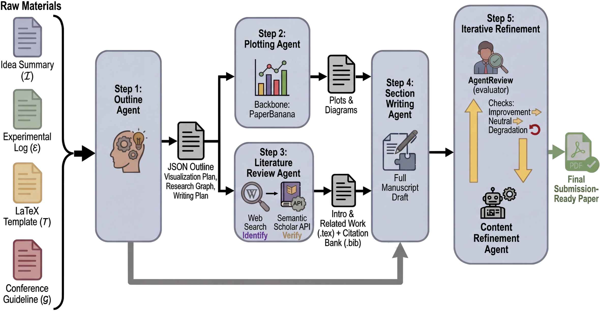

# <div align="center">🎻 PaperOrchestra: A Multi-Agent Framework for Automated AI Research Paper Writing</div>
<div align="center">Yiwen Song<sup>1</sup>, Yale Song<sup>1</sup>, Tomas Pfister<sup>1</sup>, and Jinsung Yoon<sup>1</sup></div>
<div align="center"><sup>1</sup>Google Cloud AI Research</div>
<br><br>

PaperOrchestra aims to turn raw pre-writing research materials into a
submission-ready LaTeX manuscript, with literature synthesis, generated figures,
and a compiled PDF. Artifact checks and independent model review support that
goal; they do not certify scientific correctness, novelty, or venue acceptance.

中文用户使用指南：[USER.md](USER.md)。开发者 Docker 验收流程见 [DEV.md](DEV.md)。

**This fork is a rewrite.** The original Python/Conda multi-agent pipeline has
been replaced by a standalone OpenCode-native agent in TypeScript. The writing
capability is PaperOrchestra's; the runtime is not.

<div align="center">
  
</div>

## What is different from upstream

"Upstream" here means the original
[google-research/paper-orchestra](https://github.com/google-research/paper-orchestra)
— the Python/Conda multi-agent pipeline this repository was forked from, and
whose paper is cited below. The writing capability is theirs. What changed is
the runtime and the checks around it.

- **Model-agnostic.** Every model call goes through an OpenCode session, so the
  provider is a flag. Upstream required Vertex or `GEMINI_API_KEY`.
- **Validators decide when a stage is done**, never the model's own prose. A
  stage completes because artifacts exist and pass schema and content checks.
- **Mechanical work belongs to the controller.** LaTeX builds, literature
  retrieval, figure-script execution and PDF rendering run outside the session,
  cost zero model tokens, and cannot be faked by a textual claim. The agent has
  `bash`, `webfetch` and `websearch` denied.
- **Resumable.** Stage-level state, digest-locked inputs, and a git checkpoint
  per stage. Upstream restarted from the outline on any exception.

## Install

```bash
curl -fsSL https://raw.githubusercontent.com/a-green-hand-jack/paper-orchestra/main/scripts/install.sh | bash
```

This builds and links `paper-orchestra` globally. Re-run it to upgrade. From a
clone, `./scripts/install.sh` does the same thing from your working copy.

Then check what the machine is missing:

```bash
paper-orchestra doctor
```

It separates hard requirements from optional capabilities, so an absent
`matplotlib` is reported as a warning rather than a failure.

| Needed for | What |
|---|---|
| Everything | Node.js >= 20; [OpenCode](https://opencode.ai) on `PATH`, authenticated (`opencode auth login`) |
| Building the PDF | `pdflatex`, `bibtex`, `pdftotext`, `pdftoppm` |
| Literature retrieval | the [`bohr`](https://www.bohrium.com) CLI, logged in — about 0.05 CNY per search |
| Code-generated figures | `python3` with `matplotlib` |
| Text-to-image figures | [Codex](https://developers.openai.com/codex/) logged in with ChatGPT OAuth; or an executable `PAPER_ORCHESTRA_IMAGE_ADAPTER` |

## Usage

Point it at whatever you have. One directory — a project, a repository, a
folder of notes — and PaperOrchestra explores it:

```
my-paper/                          my-project/
├── notes.md                       ├── README.md
├── results/                       ├── src/
│   └── table_main.tex             ├── experiments/
├── figures/                       │   ├── train.sh
└── references.bib                 │   └── results.csv
                                   ├── paper/
                                   │   └── template.tex  ← author kit, not a finished paper
                                   └── refs.bib          ← seeds for literature retrieval
```

No fixed input filenames are required. A discovered author kit can supply the
template; an explicit `--template` or commissioning `--brief` takes precedence.
Otherwise a template is selected from the paper's topic. Finished manuscripts
are not treated as raw research or automatically reused as author kits.
A supplied bibliography seeds literature retrieval by default. Supplied figures
can be reused, and generation of planned new figures is enabled by default.

Then run it from there:

```bash
cd my-paper/
paper-orchestra write --allow-lkm-spend
```

This is the interactive mode: PaperOrchestra creates a durable workspace,
starts the shared controller, and attaches OpenCode's native TUI. You can inspect
the stage sessions and talk to the writing agent while the controller keeps
validation, checkpoints, and approval state on disk. Closing the TUI preserves
the workspace; run `paper-orchestra resume <workspace>` to continue it.

For an autonomous run or a call from another agent, use the same command with
`--headless`. Add `--json` for NDJSON events followed by one stable result object:

```bash
paper-orchestra write --headless --json --allow-lkm-spend -o ./paper-run
paper-orchestra status ./paper-run --json
paper-orchestra validate ./paper-run --json
```

The result object includes the absolute workspace, run state, current and next
stage, validation failures, and paths to the LaTeX, bibliography, final PDF,
review, and submission directory. `plan_completed` means the locked plan has
completed, including a shortened `--until` plan. `submission_ready` additionally
requires refinement and a passing independent review of the current manuscript
and PDF. Neither `ok: true` nor `plan_completed: true` alone means a paper is ready.

`--allow-lkm-spend` is required because literature retrieval costs real money.
Without it the run stops before paid searching. At about 0.05 CNY per call,
the default 40-call ceiling represents roughly 2 CNY, not a fixed per-paper bill.

**A supplied bibliography is a seed, not an opt-out.** The default
`--bibliography-mode seed` permits retrieval to supplement it and still requires
`--allow-lkm-spend`. Choose `--bibliography-mode closed` explicitly to restrict
citations to the supplied collection and skip paid retrieval. Closed mode needs
a supplied bibliography; it does not make writing, review, or image generation
free of provider costs.

### Common variations

```bash
# a specific model; planned figure generation is already enabled
paper-orchestra write --model openai/gpt-5.6-terra --allow-lkm-spend

# use only a supplied bibliography, and disable automatic figure generation
paper-orchestra write --bibliography-mode closed --no-plotting

# a specified venue, and a fixed literature cutoff
paper-orchestra write --template iclr2026 --research-cutoff 2024-11 --allow-lkm-spend

# pause after triage, outline, literature, drafting, and refinement
paper-orchestra write --mode collaborative --allow-lkm-spend

# your own LaTeX template
paper-orchestra write --template ./my-template --allow-lkm-spend

# list supported versioned templates and CCF-A venue identities
paper-orchestra templates list --ccf-a
```

| Flag | Effect |
|---|---|
| `--template <venue\|dir\|auto>` | Default `auto` asks the configured model to choose from reproducible current templates by topic. Any explicit adapter id or local template directory wins over the model. |
| `--model <provider/model>` | e.g. `openai/gpt-5.6-terra`; omit for OpenCode's default |
| `--stage-model <stage>=<model>` | Override one stage's model; repeatable |
| `--brief <file>` | Commissioning requirements: venue, length, section requirements; `-` reads stdin |
| `--no-plotting` | Disable default-on generation of planned figures; `--use-plotting` remains an explicit enable flag |
| `--bibliography-mode <seed\|closed>` | Default `seed` supplements supplied references; explicit `closed` skips retrieval and restricts citations to supplied keys |
| `--mode collaborative` | Pause at five gates: triage, outline, literature, section writing, refinement |
| `--headless` | Do not attach the OpenCode TUI |
| `--json` | Emit NDJSON events and a stable machine-readable result |
| `--target-citations <n>` | Override the adaptive citation target inferred from the paper's needs |
| `--max-lkm-calls <n>` | Ceiling on paid retrieval calls (default: 40) |
| `--research-cutoff <yyyy-mm>` | Treat nothing published after this as prior work |
| `--until <stage>` | Stop after a stage, locking a shorter plan |
| `-o, --output <dir>` | Workspace directory (default: `./po-run-<timestamp>`) |

### Other commands

```bash
paper-orchestra status [dir]      # per-stage state, tokens, cost
paper-orchestra validate [dir]    # re-run every check without calling a model
paper-orchestra resume [dir]      # continue from the first unfinished stage
paper-orchestra approve [dir]     # release a collaborative gate
paper-orchestra history [dir]     # the checkpoint timeline
paper-orchestra checkpoint [dir]  # record a manual checkpoint
paper-orchestra doctor
paper-orchestra templates list
paper-orchestra templates info cvpr2026
```

### Where the output lands

```
<workspace>/submission/main.tex                 portable manuscript entry point
<workspace>/submission/final.pdf                controller-built PDF
<workspace>/submission/references.bib           exported bibliography
<workspace>/submission/figures/                 exported figures
<workspace>/submission/README.md                standalone build instructions
<workspace>/.brain/manuscript/final_paper.pdf     working PDF, retained for provenance
<workspace>/.brain/manuscript/figures/            every figure used
<workspace>/.brain/manuscript/review.json         current independent review
<workspace>/.brain/raw/references.bib             the bibliography
<workspace>/.brain/raw/candidates.json            every retrieved source, auditable
```

## Features

### Validators, not self-assessment

A stage completes because its artifacts exist and pass checks — never because
the model said it was done. Checks are stage-specific, not a fixed count run
at every stage. They include:

| Validator | Catches |
|---|---|
| `schema_valid` | An artifact that does not match its schema |
| `materials_provenance` | A cited material path that was never in the input |
| `materials_grounding` | Evidence-ledger quotes or values that do not match their named source |
| `materials_selection` | A map that repeats a file, or claims to have read fewer than it lists |
| `outline_coverage` | An empty section plan, or a figure with no usable id |
| `citation_integrity` | A `\cite` key that resolves to nothing |
| `citation_floor` | A manuscript that cites far fewer sources than were found |
| `bibliography_provenance` | A bibliography entry without the required retrieval or supplied-file provenance |
| `literature_dedup` | Two entries describing the same paper |
| `figure_coverage` | A planned figure that never rendered, or one never placed |
| `figure_render` | A "rendered" figure that is really an empty canvas |
| `latex_assembly` | A build failure, unresolved `[?]` marks, content overflowing its column |
| `template_compatibility` | A manuscript that changed the venue's document class |
| `no_unresolved_markers` | Leftover placeholders or TODO markers |
| `table_coverage` | Planned tables missing from the manuscript or inconsistent with their generated provenance |
| `manuscript_readiness` | Missing, stale, incomplete, or blocking independent final-manuscript review |

A failed check's message is written as the repair instruction and is handed
back to the model verbatim.

### Controller-owned evidence

The agent runs with `bash`, `webfetch` and `websearch` denied. Everything
mechanical belongs to the controller, costs zero model tokens, and cannot be
faked by a claim in a transcript:

- **Literature retrieval** — candidates come from Bohrium LKM, are enriched
  from Crossref and DataCite, scored for relevance against the paper's own
  topic, and written to disk *before* the model sees them. The model can only
  cite admitted references. Supplied references retain file provenance; they
  seed retrieval unless `--bibliography-mode closed` explicitly disables it.
  Provenance and metadata checks do not prove that a source supports a claim.
- **Figure generation and review** — the outline agent selects a code or
  text-to-image route. The controller executes code in a scoped subprocess
  or calls an image provider, then uses a model to visually review the
  rendered output before it can pass.
- **LaTeX builds** — four-pass `pdflatex`/`bibtex`, diagnosed from the final log.
- **PDF page rendering** for visual review.

Refinement invokes an actual independent manuscript reviewer before revising the
compiled draft and again after building the final manuscript. It uses a separate
OpenCode session with tools disabled, not a writer-authored readiness report.
The controller supplies the brief, materials, outline, manuscript source,
and every rendered PDF page in batches of six. The reviewer assesses content
support, coherence, limitations, citations, figures/tables, and layout. Review
attempts and replies are retained under `.po-run/reviews/`; the current review
is bound to source/PDF hashes and the full page count. Final readiness requires
a matching controller review with no blocking findings. The reviewer may use
the same configured model as the writer; independence here means a separate
session and role, not an independent scientific authority.

### Literature quality

Retrieval is scored for relevance and the off-domain tail is dropped — LKM
indexes claims across all of science, so an unfiltered search for a
vision paper returns work in agriculture and gastroenterology. A second axis
keeps a foundational paper the outline explicitly asked for even when its
abstract shares little vocabulary with your topic.

Every entry carries its provider, provider id, relevance score, and the queries
that found it, so a bibliography can be audited after the fact.

### Resumable and reproducible

- Stage-level state in `.po-run/run.json`, and a git checkpoint per stage with
  machine-readable trailers.
- `source/` and `template/` are hashed at import and re-checked on resume, so a
  resume cannot silently change what is being written.
- Per-stage token and cost telemetry.
- Each stage runs in its own session, which bounds transcript growth.

### Input and security boundaries

Import is bounded to 5,000 files and 256 MiB total, with a 64 MiB per-file cap.
Oversized files are skipped; exceeding aggregate limits fails import. Import
and normalization manifests record exclusions and unreadable inputs rather than
silently treating them as evidence. Manuscript/template/bibliography roles are
separated from raw research using path and content heuristics.

Controller-owned extractors provide bounded previews:

- PDFs: `pdftotext`, at most 200 pages, 15 seconds, and 2 MiB output; no OCR.
- CSV/TSV and JSONL/NDJSON: up to 200 rows; JSON previews and saved notebook
  cells/outputs are bounded too. Notebook cells are not executed.
- SQLite: read-only immutable snapshots, at most 20 ordinary tables and 200
  rows per table; no views, virtual tables, or uncheckpointed WAL contents.
- NumPy `.npy`/`.npz`: requires NumPy, disables pickle loading, and summarizes
  at most 10,000 values per array; NPZ has 20-entry and 64 MiB expansion limits.

Data extraction uses isolated Python with a 15-second timeout and bounded
output; structured JSON/notebook parsing is capped at 16 MiB. These are sampled
views, not exhaustive dataset statistics. Missing dependencies or extraction
failures are recorded as unreadable, not replaced by inferred results.

Sensitive filename/path rules exclude common credential files such as `.env`,
`.npmrc`, `.netrc`, and private keys, and source-path checks reject symlinks and
traversal. These rules are not a general secret-content detector: sanitize the
materials before import, especially databases and arbitrarily named files.
Agent shell/network tools are denied, but controller retrieval and image
providers can use the network. Generated figure scripts use a scoped subprocess,
restricted environment, and timeout, not a hardened OS sandbox or guaranteed
network isolation. Run untrusted inputs/code in an appropriately isolated host.

### Model-agnostic

Every writing and reviewing call goes through an OpenCode session, so the
provider is a flag and can differ per stage. Figure generation also has two
explicit routes. Quantitative plots default to controller-executed code and must
produce PDF. Conceptual diagrams default to Codex's built-in `gpt-image-2`
generation when `codex login status` reports a ChatGPT login. This uses the
existing Codex OAuth session and does not require `OPENAI_API_KEY`:

```bash
codex login
paper-orchestra write --allow-lkm-spend
```

Set an external adapter only when another image provider or a custom image
service should override the Codex default:

```bash
export PAPER_ORCHESTRA_IMAGE_ADAPTER=/absolute/path/to/image-adapter
paper-orchestra write --allow-lkm-spend
```

The adapter reads one JSON request from stdin and returns one JSON object with
`provider`, `model`, `output_path`, and optional `parameters`. Its provider,
model, prompt, parameters, route, and output are recorded in
`plotting_results.json`. If a requested route is unavailable, the stage stops
with setup guidance instead of silently omitting the figure.

## The pipeline

| # | Stage | Produces |
|---|---|---|
| 1 | `triage` | `materials.json` — which files to read, the grounded facts, the gaps |
| 2 | `outline` | `outline.json` — section plan, citation hints, figure plan |
| 3 | `literature` | `references.bib`, `citation_map.json`, `candidates.json` |
| 4 | `plotting` | `figures/*`, `plotting_results.json` |
| 5 | `section_writing` | `raw_draft.tex` |
| 6 | `refinement` | `final_paper.tex`, `final_paper.pdf` |

Stage 1 runs model triage for every input, including small material sets; it
does not rewrite them. Every later stage reads
the author's own files, and `materials.json` tells it which ones are worth
opening and carries the ledger of measured numbers, each with a quote copied
verbatim from the file it came from. Validators check the ledger against those
files, but do not prove every manuscript claim or scientific inference. Imported
files remain available beyond the map, subject to the recorded input roles and
readability limits. Only explicit closed bibliography mode skips retrieval;
the presence of a bibliography alone does not skip literature work.

Retrieval (stage 3) is controller-owned: candidates come from Bohrium LKM, are
enriched from Crossref and DataCite, scored for relevance against the paper's
own topic, and written to disk before the model sees them. The model can only
cite the admitted reference set, including supplied seeds, or only the supplied
collection in closed mode. This constrains citation keys and provenance, not
the scientific truth of the resulting prose.

Figures (stage 4) use the route selected in `outline.json`. Code generation runs
in a scoped subprocess and accepts PDF only; text-to-image uses
Codex's ChatGPT-authenticated built-in image generation by default, with
`PAPER_ORCHESTRA_IMAGE_ADAPTER` as an explicit override. Both outputs are
rendered to pixels, attached to a visual critic, and receive bounded repairs or fail with
the critic's concrete finding. Supplied figures continue to work without either
generation dependency.

## Workspace layout

```
<workspace>/
├── .brain/{input,raw,manuscript,tmp}   # artifacts, drafts, figures
├── source/                            # imported materials, read-only, digested
├── template/                          # LaTeX template, read-only, digested
├── submission/                        # exported manuscript and build dependencies
├── .opencode/                         # per-run agent config and prompts
└── .po-run/{run.json,session.json,checkpoints/,logs/}
```

`source/` and `template/` are hashed at import and re-checked on resume, so a
resume detects changed imported inputs. See the input/security boundaries above
for import exclusions and their limits.

## Gewu preparation and end-to-end workflow

`scripts/prepare-gewu.py` prepares the raw-only Issue48 writing task without
launching a model. It uses an authenticated `hf` CLI cache to fetch an allowlist
from `Jack-Jieke-Wu/Gewu-Solutions`, pinned to revision
`576302afd4bc95cd3b3ed809f4822c611a1ea95f`, solution
`lewton-agent_kerrDeflection-solution__57b47284`. The source manifest marks it
accepted, while `problem.yaml` says candidate; supplied passing audit logs are
raw-evidence provenance, not verification of live journal acceptance.

The allowlist contains notes, problem/rubric, code, CSVs, and existing audit logs,
not finished papers, manuscript TeX, extracted paper prose, bibliographies,
prebuilt figures, or archives. Preparation checks remote blob hashes and CSV
consistency, records inclusion/exclusion decisions and SHA-256 hashes, and freezes
the brief and verifier under the gitignored `datasets/gewu-issue48/` directory.

From this clone, with the writing dependencies configured:

```bash
python3 scripts/prepare-gewu.py
npm run build
node dist/cli.js doctor
node dist/cli.js write datasets/gewu-issue48/input \
  --brief datasets/gewu-issue48/benchmark/gewu-kerr-no-assets/instruction.md \
  --headless --json --allow-lkm-spend -o ./po-run-gewu
node dist/cli.js status ./po-run-gewu --json
node dist/cli.js validate ./po-run-gewu --json
```

The brief is essential: it requires a new 6-12 page English paper, at least five
independently retrieved references, a new quantitative PDF plot and conceptual
image, numerical cross-checks, and explicit limitations. It forbids retrieving
the finished source paper or running new simulations. Local CLI output lands in
`po-run-gewu/submission/`; the brief/verifier's `/workspace/submission` and
`/workspace/po-run-harbor` paths describe the benchmark environment, not the local
output layout. Its `submission-status.json` completion marker is a benchmark
contract, not a file the standalone CLI export currently creates.

Inspect `submission_ready`, the independent review, the exported PDF, and the
standalone build instructions before assessing the result. Preparation checks and
tooling smoke checks are not an end-to-end writing pass. **No successful Gewu end-to-end
run is claimed here**; the frozen verifier and human scientific/visual review
still need to assess the generated manuscript.

## Docker Real-CLI Acceptance

See [DEV.md](DEV.md) for the developer-as-user workflow, online service checks,
narrow bohr/HF identity mounts, arbitrary CLI execution, and all six run budgets.
User-simulation commands use **online bridge networking by default**; only the
extra independent recompilation is forced offline.

`npm test` (also `npm run test:docker`) runs the **real packaged CLI in Docker**,
not mocks or unit tests. It builds the current working copy, runs `doctor`, then
`write --headless --json`, `status --json`, and `validate --json`. Successful
writing must report `submission_ready: true` and export `workspace/submission/`.
The harness then launches a separate network-disabled, credential-free container,
copies only that export, removes prebuilt manuscript/build products from the copy,
and compiles `main.tex` with LaTeX/BibTeX or Biber via `latexmk`. It also checks
the rebuilt PDF with Poppler. Failure at any required step fails acceptance;
the first failed CLI exit code is preserved. No model response can substitute
for these commands. A passing run is still not scientific or venue certification.

### Build and Tool Checks

Requires Docker with BuildKit, a working daemon, and host Node >=20. No host
TeX, Python environment, `dist/`, or `node_modules/` is used by the image:

```bash
npm run test:docker -- build
npm run test:docker -- tools
```

Both commands build `paper-orchestra:e2e`. `tools` runs installed CLI help,
version/import checks, and the actual doctor with online networking, an empty
HOME and **no secrets mounted**. Its doctor is expected to exit nonzero without
authenticated providers. Neither command claims a manuscript acceptance pass.
The initial TeX image build takes several minutes and several GB; later builds
reuse dependency layers while rebuilding changed source.

The multi-stage build uses `npm ci`, TypeScript build, `npm shrinkwrap` derived
from the project lock, and `npm pack`; the runtime globally installs that tarball.
The allowlisted build context excludes host datasets, outputs, Git history,
credentials, `.env*`, auth files, and dependencies. Do not put secrets in source
files under arbitrary names: filename exclusions are not a content scanner.

Default pins are Node `22.22.0-bookworm-slim` at the digest in `Dockerfile`,
Debian's signed `20260901T000000Z` snapshot, official npm packages
`opencode-ai@1.18.29`, `@openai/codex@0.153.4`, and
`@dptech-corp/bohr-cli@2.6.86`, plus container-native `huggingface_hub==1.30.0`
installed from `https://pypi.org/simple` in `/opt/hf`. npm downloads use
`https://registry.npmjs.org`; apt uses the dated `snapshot.debian.org` archives
with signature verification enabled. Resolved package inventories are in the
image at `/opt/package/{debian-packages.txt,npm-packages.json,hf-packages.txt}`. CLI version pins
do not freeze remote model behavior. For exact reuse, retain the recorded image
ID, rather than relying on a mutable tag or a future rebuild.

### Credentials and Live Run

The harness discovers only standard bohr/HF identity paths, never opens their
contents on the host, and supports explicit paths to individual read-only runtime
mounts. Text/image OAuth paths are always explicit. Do not pass secret values
as environment variables, Docker build arguments, or command arguments.

| Variable | Integration |
|---|---|
| `PO_MODEL` | Required OpenCode `provider/model[:variant]`, with text and image-input support for review |
| `PO_TEXT_CONFIG_FILE` | Required secret-free OpenCode JSON; mounted at `/run/secrets/text-config.json` as `OPENCODE_CONFIG` |
| `PO_MODEL_KEY_FILE` | Optional single-line key; runtime-only `PO_MODEL_KEY`, referenced as `{env:PO_MODEL_KEY}` in JSON |
| `PO_OAUTH_PROVIDER_FILE`, `PO_TEXT_AUTH_FILE` | Optional paired mounts for the governed text OAuth route; use `docker/opencode.oauth.example.json`, no model API key required |
| `PO_CODEX_AUTH_FILE` | Required Codex ChatGPT OAuth auth file, read-only mounted and copied into isolated tmpfs `CODEX_HOME` for safe refresh |
| `PO_LKM_KEY_FILE` | Single-line Bohrium key; runtime-only `BOHR_ACCESS_KEY`; an alternative to a mounted bohr profile |
| `PO_BOHR_CONFIG_DIR` | Narrow bohr configuration/auth directory; read-only mount copied into tmpfs `BOHR_CONFIG_DIR` |
| `PO_HF_HOME` | HF identity directory; only `token` and optional `stored_tokens` are mounted, not dataset/model caches |
| `PO_HF_TOKEN_FILE` | Overrides the active token path from `PO_HF_HOME` |
| `PO_ALLOW_PAID` | Must equal `1`; explicitly authorizes real writing/review, image generation and LKM spending |

Adapt `docker/opencode.example.json` with the approved provider's exact HTTPS
base URL, model ID, supported context/output limits, and provider SDK. The
template contains placeholders, not a working endpoint or credentials. Its
provider `env` declaration allows the official OpenCode auth listing to recognize
the runtime key. The example uses a pinned OpenAI-compatible SDK; providers
requiring Responses or other protocols need the corresponding OpenCode SDK.
Do not mount your full host OpenCode config/plugin tree. LKM uses bohr's official
`https://open.bohrium.com/openapi/v2/lkm` service; Codex uses its official ChatGPT
OAuth/image integration, not the text model's custom endpoint. Rotated OAuth
state is discarded at container exit; maintain the host login separately.

With those non-secret environment settings configured, one command starts a
fresh build and live acceptance:

```bash
PO_ALLOW_PAID=1 npm test
```

By default it uses the existing raw-only `datasets/gewu-issue48/input` and
`datasets/gewu-issue48/benchmark/gewu-kerr-no-assets/instruction.md`. It downloads
no dataset and mounts no prior Gewu runs, finished papers, or repository. If the
prepared input is missing, preparation is a separate explicit action described
above; the harness does not fetch the full source solution. The brief prohibits
retrieving finished papers and running new simulations.

### Outputs and Bounds

Default output is a fresh `docker-output/<UTC-timestamp>-<pid>/`, printed before
building. Set `PO_OUTPUT_DIR` to select another **new dedicated directory**.
Existing output is refused unless explicitly resuming or using `exec`:

```bash
PO_ALLOW_PAID=1 PO_OUTPUT_DIR=/absolute/path/to/previous-output npm run test:docker -- resume
```

An explicit `PO_MAX_TOTAL_TOKENS` on resume increases only the effective token
limit, with an audit record and without resetting consumption. Without this
explicit setting, all existing limits are preserved.

Resume calls `paper-orchestra resume /output/workspace --headless --json` and
preserves previous acceptance attempts. CLI digest locks and persisted scope
remain authoritative; new run knobs do not rewrite a resumed plan. It rebuilds
the current source, so retain the recorded image/source when exact replay matters.

| Variable | Default / Bounds |
|---|---|
| `PO_DOCKER_IMAGE` | `paper-orchestra:e2e` |
| `PO_DOCKER_NETWORK` | `bridge`; custom named networks or explicit `none` supported; host networking refused |
| `PO_MATERIALS_DIR`, `PO_BRIEF_FILE` | Override only the selected raw materials and commissioning brief |
| `PO_MAX_LKM_CALLS` | `10`, range 0-100; live seed retrieval requires a positive budget |
| `PO_TARGET_CITATIONS` | `5`, range 5-100 |
| `PO_RESEARCH_CUTOFF` | `2026-09` |
| `PO_TIMEOUT_MULTIPLIER` | `1`, range 0.1-10 |
| `PO_TIMEOUT_SECONDS` | `7200`, range 60-86400; container write deadline plus 180 seconds for diagnostics |
| `PO_MAX_TOTAL_TOKENS` | `8000000`, CLI `--max-total-tokens` |
| `PO_MAX_TOTAL_COST` | `100` USD known model costs, CLI `--max-total-cost` |
| `PO_MAX_MODEL_CALLS` | `80`, CLI `--max-model-calls` |
| `PO_MAX_IMAGE_CALLS` | `12`, CLI `--max-image-calls` |
| `PO_MAX_OPERATION_CALLS` | `64`, CLI `--max-operation-calls` |
| `PO_MAX_RUN_MINUTES` | `120`, CLI `--max-run-minutes` |

All six limits are forwarded explicitly on fresh acceptance runs. LKM limits do
not cap model/image spending; time and resource limits are not monetary caps.
Unreported provider charges remain unknown, not free. Use provider-side caps for paid
runs. The container is limited to 4 CPUs, 8 GiB RAM and 512 processes.

`acceptance.json` records build/image identity, bounds, command outcomes, timing,
status/totals and independent recompile evidence. `runtime-acceptance.json`
records doctor/write/status/validate; `recompile-*/` contains the separate build,
logs and `recompile-acceptance.json`. Arbitrary provider stdout/stderr is not
copied into harness logs, to avoid credential-bearing diagnostics. The CLI's own
workspace provenance remains under `workspace/.po-run/`; treat research outputs
as private. Build-only success leaves acceptance `ok: false` deliberately.
`services` and `exec` also leave manuscript `ok: false`; their own result and
`command_ok` report success separately. They discard raw API/auth/command output,
retaining sanitized statuses and the allowlisted Gewu dataset ID/revision only.

Runtime uses the host non-root UID/GID, a read-only root filesystem, dropped
capabilities, no-new-privileges, and disposable writable HOME/tmpfs. Only
`/materials` and the brief are read-only research mounts; only the dedicated
`/output` is host-writable. No host HOME, repository, root directory, Docker
socket, ports, or host network is exposed. The model container needs outbound
provider access; independent recompilation has no network or secrets. Containers
reduce exposure but are not a security boundary against a compromised Docker
daemon/kernel or permission to feed untrusted generated code privileged access.

## Development Checks

```bash
npm run typecheck
npm run build
npm test  # real Docker acceptance, requires the explicit live settings above
```

The tracked `tests/` suite has been removed; no replacement unit-test suite is
hidden elsewhere. Build/typecheck remain credential-free development checks.

## Project structure

- `src/` — the agent: controller, stages, validators, retrieval, LaTeX and
  figure execution
- `src/assets/commands/` — the stage prompts, hand-edited and authoritative
- `src/templates/` — conference LaTeX templates; add one as a new subdirectory
- `docker/`, `scripts/docker-e2e.mjs` — isolated real-CLI Docker acceptance

## Citation

If you find this repo or our paper helpful, please cite it as follows:

```bibtex
@article{song2026paperorchestra,
  title={PaperOrchestra: A Multi-Agent Framework for Automated AI Research Paper Writing},
  author={Song, Yiwen and Song, Yale and Pfister, Tomas and Yoon, Jinsung},
  journal={arXiv preprint arXiv:2604.05018},
  year={2026}
}
```

# Disclaimer

This is not an officially supported Google product.
